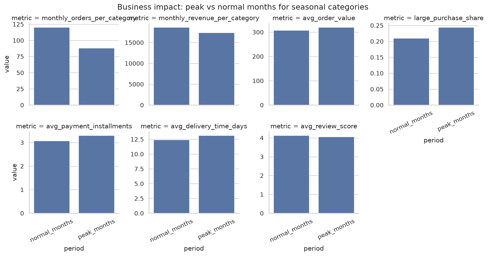
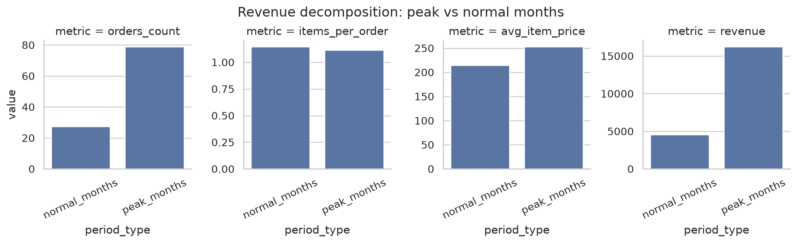
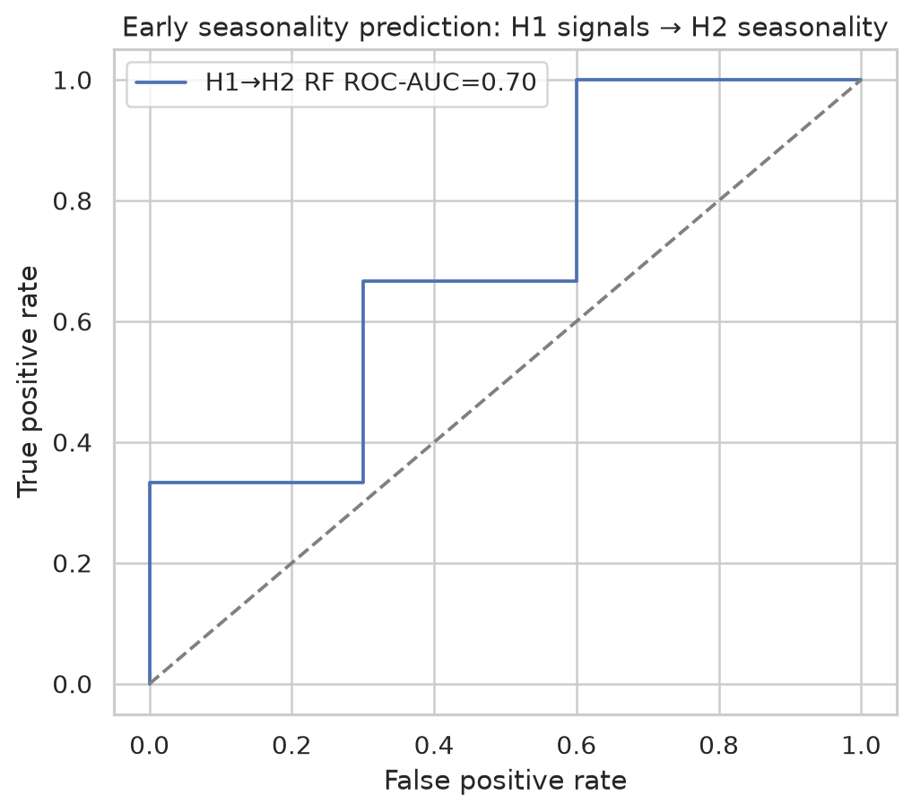
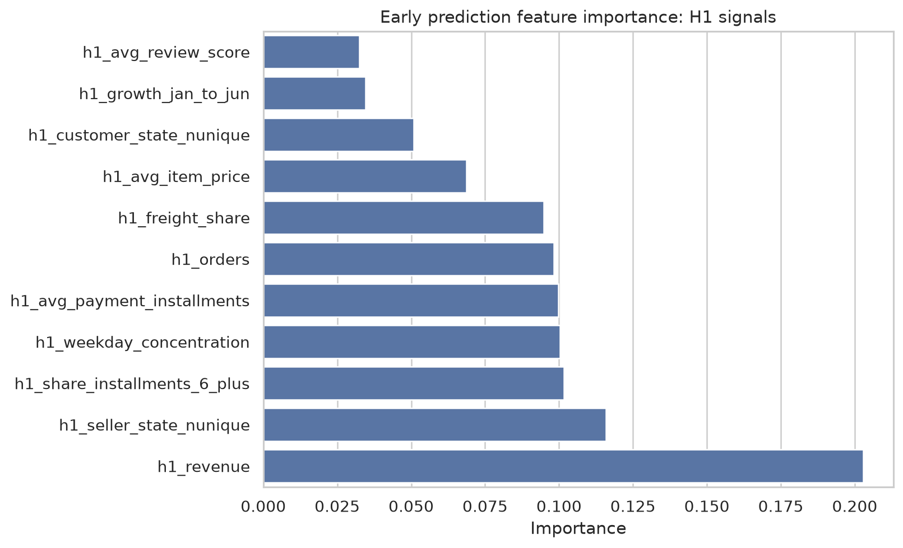
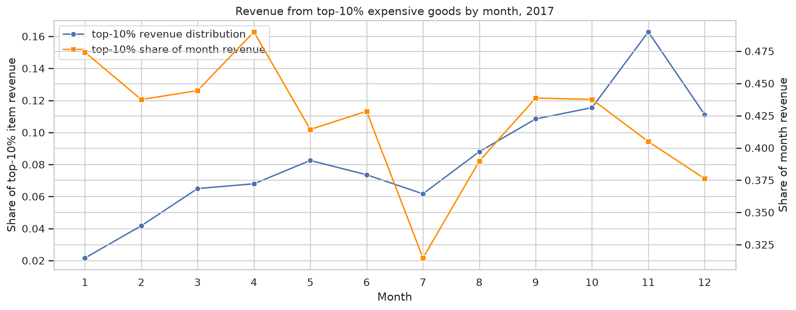
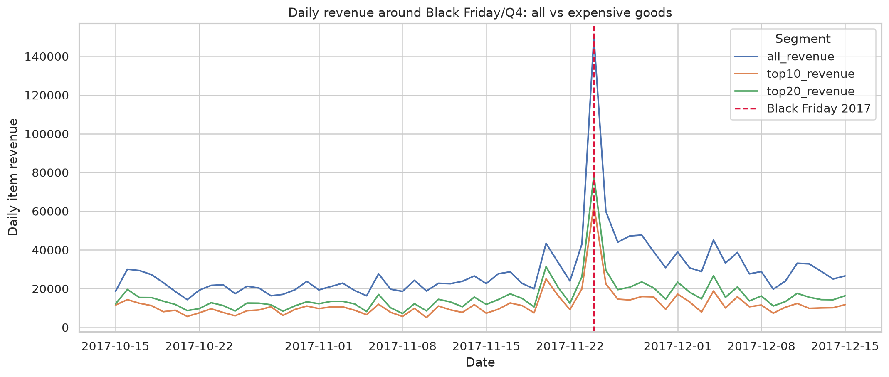

# Анализ сезонности в Olist Store

Бразильский маркетплейс электронной коммерции

Открытый набор данных за 2016–2018 годы

Основной вопрос
Как сезонность влияет на спрос и какие товары подвержены ей сильнее всего?

Дополнительные вопросы
Бизнес-метрики · прогнозируемость сезонного спроса · периоды крупных покупок

Александр @alxadrb · Тимур @coucco · Максим @werserk

<!--
Мы выбрали кейс Olist Store — бразильский маркетплейс электронной коммерции.

Работа основана на открытом наборе данных Olist Brazilian E-Commerce Public Dataset. В нём собраны заказы, товары, платежи, доставка и отзывы за 2016–2018 годы.

Основной вопрос — как сезонность влияет на спрос и какие товары зависят от неё сильнее всего.

Дополнительно мы проверяем влияние сезонности на бизнес-метрики, признаки прогнозируемого сезонного спроса и периоды крупных покупок.
-->

---
layout: default
class: dataset-slide
---

# Состав данных

9 таблиц · 1 556 417 строк суммарно · заказы за 2016–2018 годы

<table class="dataset-table">
<thead>
<tr><th>Таблица</th><th>Строк</th><th>Столбцов</th></tr>
</thead>
<tbody>
<tr><td>Заказы</td><td>99 441</td><td>8</td></tr>
<tr><td>Товары в заказах</td><td>112 650</td><td>7</td></tr>
<tr><td>Платежи</td><td>103 886</td><td>5</td></tr>
<tr><td>Отзывы</td><td>104 719</td><td>7</td></tr>
<tr><td>Товары</td><td>32 951</td><td>9</td></tr>
<tr><td>Покупатели</td><td>99 441</td><td>5</td></tr>
<tr><td>Продавцы</td><td>3 095</td><td>4</td></tr>
<tr><td>География</td><td>1 000 163</td><td>5</td></tr>
<tr><td>Перевод категорий</td><td>71</td><td>2</td></tr>
</tbody>
</table>

<h2>Ключевые поля анализа</h2>

Дата заказа<code>order_purchase_timestamp</code>

Категория товара<code>product_category_name</code>

Стоимость<code>price</code><code>payment_value</code>

Статус заказа<code>order_status</code>

<!--
На этом слайде зафиксированы главные переменные анализа.

Нам важны дата оформления заказа, категория товара, цена, сумма платежа и статус заказа.

Дата связывает наблюдение с календарём. Категория показывает, где меняется спрос. Цена и сумма платежа дают денежные показатели. Статус нужен, чтобы отделить завершённые заказы от остальных.

Дальше анализ строится вокруг этих полей.
-->

---
layout: default
class: coverage-slide
---

# Период наблюдений

Доставленные заказы: <strong>96 478</strong>

<table class="coverage-table">
<thead>
<tr><th>Год</th><th>Месяцев</th><th>Период</th></tr>
</thead>
<tbody>
<tr><td>2016</td><td>3</td><td>сентябрь, октябрь, декабрь</td></tr>
<tr><td>2017</td><td>12</td><td>январь — декабрь</td></tr>
<tr><td>2018</td><td>8</td><td>январь — август</td></tr>
</tbody>
</table>

Основной год для сезонных сравнений — <strong>2017</strong>.

<!--
Для сезонного анализа мы используем только доставленные заказы. Таких заказов в данных 96 478.

Период наблюдений неравномерный. В 2016 году есть только три месяца: сентябрь, октябрь и декабрь. В 2017 году есть полный календарный год: с января по декабрь. В 2018 году есть восемь месяцев: с января по август.

Поэтому основной год для сезонных сравнений — 2017. Он единственный покрывает все месяцы года. 2016 и 2018 мы используем как контекст, но не как полноценные годы для сравнения сезонных циклов.
-->

---
layout: default
class: method-slide
---

# Как измеряем сезонность спроса

Вопрос блока
Как сезонность влияет на спрос и какие товары подвержены ей сильнее всего?

1
Помесячная агрегация спроса по категориям за 2017 год

2
Сезонный индекс: спрос месяца / средний месячный спрос

3
Seasonality score: коэффициент вариации месячного спроса

4
Фильтр достоверности: заказы и активные месяцы

5
Классификация профиля сезонности

<!--
В этом блоке мы измеряем сезонность на уровне категорий товаров.

Сначала для каждой категории считаем помесячный спрос за 2017 год. В качестве спроса используем количество доставленных заказов.

Затем считаем сезонный индекс: спрос в конкретном месяце делится на средний месячный спрос этой категории. Значение выше единицы означает, что месяц сильнее обычного для этой категории.

Для ранжирования категорий используем коэффициент вариации месячного спроса. Чем выше коэффициент, тем сильнее спрос меняется между месяцами.

Чтобы не ловить шум малых категорий, применяем фильтр достоверности по числу заказов и количеству активных месяцев. После этого классифицируем профиль сезонности: резкий месячный пик, квартальный пик, стабильный спрос или смешанный профиль.
-->

---
layout: default
class: demand-slide
---

# Общий спрос меняется по месяцам

Доставленные заказы, 2017
43 428 заказов

Максимум
ноябрь — 7 289 заказов

Минимум
январь — 750 заказов

Размах
пик в 9,7 раза выше минимума

Пик / средний месяц
2,0

<!--
Начнём с общего спроса по месяцам.

Здесь мы берём доставленные заказы за 2017 год и считаем количество заказов в каждом месяце. Это даёт базовую сезонную картину без разбиения на категории.

По общей динамике видно, что спрос распределён неравномерно. Максимум приходится на ноябрь: 7 289 заказов. Минимум — январь: 750 заказов. Ноябрьский пик примерно в 9,7 раза выше января и в 2 раза выше среднего месяца.

Но общий график показывает только агрегированный эффект. Он не отвечает, какие категории создают сезонность. Поэтому дальше мы переходим от общего спроса к спросу по категориям.
-->

---
layout: default
class: seasonal-categories-slide
---

# Самые сезонные категории

Seasonality score
CV = σ(месячного спроса) / μ(месячного спроса)

<table class="seasonal-categories-table">
<thead>
<tr><th>Категория</th><th>Пик</th><th>Score</th><th>Пик / средний</th></tr>
</thead>
<tbody>
<tr><td><code>computers</code></td><td>сен</td><td>1,33</td><td>3,9</td></tr>
<tr><td><code>construction_tools_construction</code></td><td>ноя</td><td>1,25</td><td>4,3</td></tr>
<tr><td><code>home_construction</code></td><td>ноя</td><td>1,15</td><td>3,6</td></tr>
<tr><td><code>food_drink</code></td><td>ноя</td><td>0,93</td><td>3,2</td></tr>
<tr><td><code>kitchen_dining_laundry_garden_furniture</code></td><td>ноя</td><td>0,83</td><td>3,2</td></tr>
<tr><td><code>stationery</code></td><td>дек</td><td>0,78</td><td>3,1</td></tr>
</tbody>
</table>

В рейтинг включены категории с уровнем достоверности medium или high.

<!--
После общей динамики переходим к категориям.

Для каждой категории мы рассчитали seasonality score как коэффициент вариации месячного спроса: стандартное отклонение делится на среднее. Чем выше значение, тем сильнее спрос категории меняется между месяцами.

В рейтинг включены только категории с достаточным числом заказов и активных месяцев. Это нужно, чтобы случайные всплески малых категорий не попадали в ответ как сезонность.

Верхние позиции занимают категории, где пиковый месяц в несколько раз выше обычного уровня. Например, у construction_tools_construction ноябрьский пик в 4,3 раза выше среднего месяца, у computers сентябрьский пик в 3,9 раза выше среднего.

Значит, сезонность в Olist Store лучше видна на уровне отдельных товарных категорий, а не только на общей кривой спроса.
-->

---
layout: default
class: seasonal-profiles-slide
---

# Сезонность имеет разные профили

Категорий после фильтра
39

Чаще всего
event-driven — 25 категорий

Пиковый месяц
ноябрь — 26 категорий

Примеры
trend-driven: <code>computers</code> 
single-month spike: <code>stationery</code> 
holiday Q4: <code>furniture_decor</code>

<!--
Рейтинг показывает силу сезонности, но не показывает её форму.

На этом слайде видно, что категории ведут себя по-разному. У части категорий есть резкий пик одного месяца. У других спрос концентрируется в четвёртом квартале. У части категорий видны отдельные событийные всплески.

После фильтра достоверности остаётся 39 категорий. Самый частый тип профиля — event-driven: 25 категорий. Самый частый пиковый месяц — ноябрь: он является максимумом для 26 категорий.

Поэтому ответ не сводится к одной общей сезонной волне. Сезонность есть, но её профиль зависит от категории.
-->

---
layout: default
class: answer-slide
---

# Ответ на вопрос 1

Сезонность влияет на спрос неравномерно: общий спрос имеет месячные пики, но сильнее всего эффект виден на уровне категорий.

Общий спросноябрь — 7 289 заказов, пик / средний месяц = 2,0

Самые сезонные категории<code>computers</code>, <code>construction_tools_construction</code>, <code>home_construction</code>, <code>food_drink</code>, <code>stationery</code>

Метрикаseasonality score = CV месячного спроса

Ограничениевывод надёжнее на уровне категорий, чем на уровне отдельных товаров

<!--
Теперь можно ответить на первый вопрос.

Сезонность влияет на спрос, но не одинаково для всего магазина. На общем уровне видно, что ноябрь даёт максимум: 7 289 доставленных заказов. Это примерно в 2 раза выше среднего месяца 2017 года.

Главный эффект появляется на уровне категорий. По коэффициенту вариации месячного спроса сильнее всего выделяются computers, construction_tools_construction, home_construction, food_drink и stationery.

При этом профили сезонности разные: где-то это резкий месячный пик, где-то рост к четвёртому кварталу, где-то отдельные событийные всплески.

Вывод по отдельным товарам слабее, потому что у многих товаров короткая история продаж. Поэтому основной ответ даём на уровне категорий.
-->

---
layout: default
class: method-slide
---

# Как проверяем бизнес-метрики

Вопрос блока
Меняется ли не только спрос, но и экономика заказа в сезонный пик?

1Берём сезонные категории после фильтра достоверности

2Для каждой категории определяем peak month

3Делим наблюдения на peak months и normal months

4Сравниваем цену, крупные покупки, рассрочки, доставку и отзывы

5Интерпретируем эффект как изменение структуры заказа

<!--
В первом блоке мы показали, что сезонность видна в спросе и особенно на уровне категорий.

Во втором блоке проверяем другой вопрос: меняется ли в сезонный пик экономика заказа.

Для этого берём сезонные категории после фильтра достоверности. Для каждой категории уже известен её пиковый месяц. Дальше сравниваем показатели в пиковые месяцы с обычными месяцами той же группы категорий.

Смотрим не только количество заказов, а бизнес-метрики: среднюю цену товара, долю крупных покупок, рассрочки, срок доставки и отзывы.
-->

---
layout: default
class: business-impact-slide
---

# В сезонный пик заказ становится дороже

Средняя цена товара226,2 → 250,5 <strong>+10,7%</strong>

Доля крупных покупок21,0% → 24,4% <strong>+16,2%</strong>

Среднее число installments3,08 → 3,31 <strong>+7,4%</strong>

Доля 6+ installments18,6% → 21,4% <strong>+14,8%</strong>

Доставка12,45 → 13,15 дня <strong>+5,6%</strong>

<!--
Главный результат: сезонный пик меняет не только объём спроса, но и структуру заказа.

В пиковые месяцы средняя цена товара выше: 250,5 против 226,2 в обычные месяцы. Это рост на 10,7%.

Доля крупных покупок тоже выше: 24,4% против 21,0%. Также растёт использование рассрочки: среднее число installments увеличивается с 3,08 до 3,31, а доля платежей на 6 и более installments растёт с 18,6% до 21,4%.

Есть и операционный эффект: среднее время доставки увеличивается с 12,45 до 13,15 дня.
-->

---
layout: default
class: business-revenue-slide
---

# Рост выручки связан не только с числом заказов

Normal months
orders per category: <strong>27,4</strong> 
items per order: <strong>1,15</strong> 
avg item price: <strong>214,8</strong> 
revenue: <strong>4 534,6</strong>

Peak months
orders per category: <strong>79,0</strong> 
items per order: <strong>1,11</strong> 
avg item price: <strong>253,1</strong> 
revenue: <strong>16 244,1</strong>

Интерпретацияпик выручки создают одновременно объём заказов и более дорогой товарный состав

<!--
Теперь раскладываем эффект выручки.

В обычные месяцы на категорию приходится в среднем 27,4 заказа, а в пиковые — 79,0. Это основной объёмный эффект.

Но меняется не только количество заказов. Средняя цена товара в пиковые месяцы выше: 253,1 против 214,8. При этом items per order почти не растёт и даже немного ниже: 1,11 против 1,15.

Значит, сезонный рост выручки нельзя объяснить только тем, что покупают больше единиц в заказе. Важен состав спроса: в пик покупают более дорогие товары.
-->

---
layout: default
class: answer-slide
---

# Ответ на вопрос 2

Сезонность меняет экономику заказа: в пиковые месяцы товары дороже, крупные покупки встречаются чаще, а рассрочки используются активнее.

Ценаavg item price: +10,7%

Крупные покупкиlarge purchase share: +16,2%

Рассрочки6+ installments share: +14,8%

Операционный рискdelivery time: +5,6%

<!--
Ответ на второй вопрос: да, сезонность влияет на бизнес-метрики.

В пиковые месяцы сезонных категорий средняя цена товара выше на 10,7%, доля крупных покупок выше на 16,2%, а доля длинных рассрочек выше на 14,8%.

Это означает, что сезонный пик — не просто больше заказов. Это другой профиль покупки: дороже, чаще с рассрочкой и с немного большей нагрузкой на доставку.

Практический вывод: для сезонных категорий нужно планировать не только запас и спрос, но и платёжные сценарии, дорогие товары и операционную нагрузку.
-->

---
layout: default
class: method-slide
---

# Как проверяем прогноз сезонного спроса

Вопрос блока
Можно ли заранее предсказать, что на определённый товар будет сезонный спрос? По каким признакам?

1Цель: is_seasonal = верхний квартиль по seasonality score

2Уровень анализа: категория, не отдельный SKU

3Baseline: признаки за весь период

4Early model: Jan–Jun → Jul–Dec

5Проверка: ROC-AUC, F1 и важность признаков

<!--
В этом блоке проверяем, можно ли заранее предсказать сезонный спрос.

Целевой признак — is_seasonal: категория попадает в верхний квартиль по seasonality score.

Анализ делаем на уровне категорий, а не отдельных SKU. У отдельных товаров история продаж часто слишком короткая.

Сравниваем два подхода: модель по признакам за весь период и раннюю проверку Jan–Jun → Jul–Dec. Оцениваем ROC-AUC, F1 и важность признаков.
-->

---
layout: default
class: prediction-result-slide
---

# ML работает только как ранний сигнал

Full-period modelROC-AUC = 0,33 F1 = 0,00

Early H1→H2 modelROC-AUC = 0,70 F1 = 0,40

Выводwarning-signal, не автоматический прогноз

<!--
Результат неоднозначный.

Модель по признакам за весь период не работает как надёжный классификатор: ROC-AUC 0,33, F1 равен нулю.

Ранняя модель Jan–Jun → Jul–Dec лучше: ROC-AUC 0,70 и F1 0,40. Это сигнал лучше случайного, но не качество для автоматического решения.

Поэтому трактовка осторожная: модель полезна как ранний warning-signal для категорий, которые нужно проверить отдельно.
-->

---
layout: default
class: prediction-features-slide
---

# Полезные признаки — ранний спрос и профиль категории

Сильный ранний сигналвыручка Jan–Jun

Ширина рынкачисло штатов продавцов и покупателей

Платёжный профильрассрочки и доля платежей 6+ installments

Поведение спросазаказы Jan–Jun и недельная концентрация

<!--
Теперь смотрим, какие признаки дают ранний сигнал.

Самый сильный признак в ранней модели — выручка за январь—июнь. Также важны число штатов продавцов, доля длинных рассрочек, концентрация спроса по дням недели, среднее число installments и количество заказов за первое полугодие.

Это не признаки одного конкретного SKU. Это признаки масштаба категории, платёжного поведения и ранней динамики спроса.

Поэтому прогноз лучше работает как категорийный риск-сигнал: какие группы стоит заранее отметить как потенциально сезонные.
-->

---
layout: default
class: answer-slide
---

# Ответ на вопрос 3

Сезонный спрос можно предсказывать частично: надёжнее как ранний сигнал по категории, а не как точный прогноз для каждого товара.

Лучший результатearly H1→H2 model: ROC-AUC = 0,70, F1 = 0,40

Слабое местоSKU-level история короткая, прогноз по отдельным товарам ненадёжен

Полезные признакиранняя выручка, объём заказов, география продавцов, рассрочки, недельная концентрация

Практический выводwarning score + категорийная экспертиза

<!--
Ответ на третий вопрос: частично да.

Сезонный спрос можно предсказывать не как точный прогноз по каждому товару, а как ранний сигнал на уровне категории.

Лучший результат даёт модель Jan–Jun → Jul–Dec: ROC-AUC 0,70 и F1 0,40. Это полезный warning-signal, но не качество для автоматического решения.

Главные признаки — ранняя выручка, объём заказов, география продавцов, рассрочки и концентрация спроса по дням недели.

Для планирования лучше сочетать warning score с категорийной экспертизой и не переносить вывод напрямую на отдельные SKU.
-->

---
layout: default
class: large-method-slide
---

# Как измеряем крупные покупки

Вопрос блока
В какие периоды люди больше склонны к крупным покупкам?

1Крупная покупка: цена товара ≥ P90

2Проверка устойчивости: top-5%, top-10%, top-15%, top-20%

3Агрегация дорогой выручки по месяцам

4Отдельная проверка Q4 / Black Friday

5Сравнение состава категорий

<!--
В этом блоке отвечаем на вопрос о крупных покупках.

Крупную покупку определяем через перцентиль цены товара, а не через фиксированную сумму. Основной порог — P90: товар попадает в верхние 10% по цене. В 2017 году это цена от 229,99.

Такой порог лучше фиксированной суммы, потому что категории отличаются по уровню цен. Для проверки устойчивости дополнительно смотрим top-5%, top-15% и top-20%.

Дальше считаем, в какие месяцы приходится дорогая выручка, отдельно проверяем Q4 и окно Black Friday, а затем смотрим, какие категории формируют этот эффект.
-->

---
layout: default
class: large-months-slide
---

# Крупные покупки концентрируются в конце года

Порог top-10%цена товара ≥ 229,99

Ноябрь16,3% дорогой выручки

Октябрь11,5%

Декабрь11,1%

Сентябрь10,8%

<!--
Основной результат виден по месячному распределению дорогой выручки.

Для определения top-10% порог цены товара равен 229,99. Среди таких дорогих товаров максимум приходится на ноябрь: 16,3% годовой дорогой выручки.

Следом идут октябрь, декабрь и сентябрь. Их доли — 11,5%, 11,1% и 10,8%.

Значит, главный период крупных покупок — конец года, особенно ноябрь.
-->

---
layout: default
class: large-effect-slide
---

# Крупные покупки нельзя смешивать с общим спросом

Q439,0% дорогой выручки top-10%

Black Friday week7,0% дорогой выручки top-10%

Устойчивостьноябрь остаётся максимумом для top-5%, top-10%, top-15%, top-20%

Интерпретациядорогая выручка зависит от событийного спроса и состава категорий

<!--
Этот эффект нельзя сводить только к общему числу заказов.

В четвёртом квартале концентрируется 39,0% дорогой выручки top-10%. Неделя Black Friday даёт 7,0% годовой дорогой выручки top-10%, то есть отдельный локальный пик.

Проверка устойчивости даёт тот же вывод: ноябрь остаётся главным месяцем для top-5%, top-10%, top-15% и top-20% дорогих товаров.

Значит, дорогие покупки нужно рассматривать отдельно: здесь важны не только объём заказов, но и событийный спрос, цена товара и состав категорий.
-->

---
layout: default
class: large-answer-slide
---

# Ответ на вопрос 4

Люди чаще совершают крупные покупки в конце года. Главный пик — ноябрь.

Главный месяцноябрь — 16,3% дорогой выручки top-10%

Сильные месяцы рядомоктябрь — 11,5%, декабрь — 11,1%, сентябрь — 10,8%

Событийное окноBlack Friday week — 7,0% годовой дорогой выручки top-10%

Планированиедорогая выручка ≠ общий спрос

<!--
Ответ на четвёртый вопрос: крупные покупки сильнее всего концентрируются в ноябре.

На долю ноября приходится 16,3% годовой выручки дорогих товаров в определении top-10%. Следом идут октябрь, декабрь и сентябрь.

Отдельно выделяется неделя Black Friday: она даёт 7,0% годовой дорогой выручки top-10%.

Практический вывод: крупные покупки нужно планировать отдельным контуром. Общий спрос показывает объём заказов, а дорогая выручка показывает, когда покупатели чаще берут более дорогие товары.
-->

---
layout: default
class: answer-slide
---

# Рекомендации бизнесу

Сезонность нужно планировать на уровне категорий и SKU, но не смешивать общий спрос, рекламные пики и крупные корзины.

Разметка сезонностистроить SKU-профили вручную для более надёжной разметки сезонности

Рекламаусилить рекламу за 2 недели до пика

Крупные корзиныотдельный промо-механизм для крупных корзин

<!--
Финально это даёт три практические рекомендации.

Первая — строить SKU-профили вручную. Модель даёт ранний сигнал, но для надёжной разметки сезонности нужна проверка по конкретным товарам.

Вторая — усиливать рекламу заранее, примерно за две недели до ожидаемого пика. Так кампания успевает набрать охват до максимального спроса.

Третья — делать отдельный промо-механизм для крупных корзин. Дорогие покупки ведут себя не так, как общий спрос, поэтому их нельзя планировать тем же контуром.
-->
