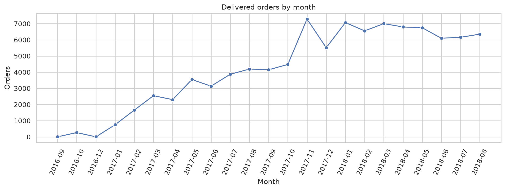
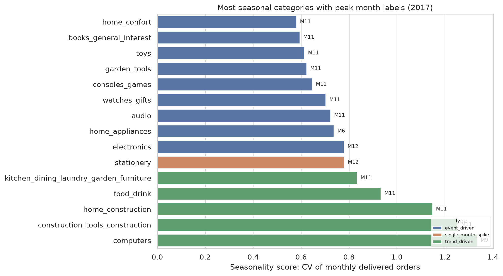
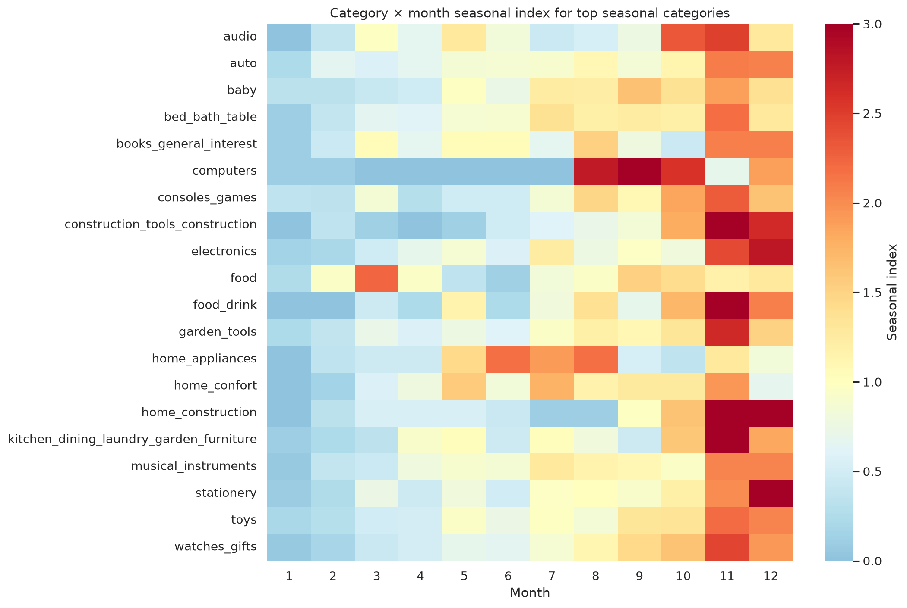

# Анализ сезонности в Olist Store

Бразильский маркетплейс электронной коммерции

Открытый набор данных за 2016–2018 годы

Основной вопрос
Как сезонность влияет на спрос и какие товары подвержены ей сильнее всего?

Дополнительные вопросы
Бизнес-метрики · прогнозируемость сезонного спроса · периоды крупных покупок

Александр @alxadrb · Тимур @coucco · Максим @werserk

<!--
Мы выбрали кейс Olist Store — бразильский маркетплейс электронной коммерции.

Работа основана на открытом наборе данных Olist Brazilian E-Commerce Public Dataset. В нём собраны заказы, товары, платежи, доставка и отзывы за 2016–2018 годы.

Основной вопрос — как сезонность влияет на спрос и какие товары зависят от неё сильнее всего.

Дополнительно мы проверяем влияние сезонности на бизнес-метрики, признаки прогнозируемого сезонного спроса и периоды крупных покупок.
-->

---
layout: default
class: dataset-slide
---

# Состав данных

9 таблиц · 1 556 417 строк суммарно · заказы за 2016–2018 годы

<table class="dataset-table">
<thead>
<tr><th>Таблица</th><th>Строк</th><th>Столбцов</th></tr>
</thead>
<tbody>
<tr><td>Заказы</td><td>99 441</td><td>8</td></tr>
<tr><td>Товары в заказах</td><td>112 650</td><td>7</td></tr>
<tr><td>Платежи</td><td>103 886</td><td>5</td></tr>
<tr><td>Отзывы</td><td>104 719</td><td>7</td></tr>
<tr><td>Товары</td><td>32 951</td><td>9</td></tr>
<tr><td>Покупатели</td><td>99 441</td><td>5</td></tr>
<tr><td>Продавцы</td><td>3 095</td><td>4</td></tr>
<tr><td>География</td><td>1 000 163</td><td>5</td></tr>
<tr><td>Перевод категорий</td><td>71</td><td>2</td></tr>
</tbody>
</table>

<h2>Ключевые поля анализа</h2>

Дата заказа<code>order_purchase_timestamp</code>

Категория товара<code>product_category_name</code>

Стоимость<code>price</code><code>payment_value</code>

Статус заказа<code>order_status</code>

<!--
На этом слайде зафиксированы главные переменные анализа.

Нам важны дата оформления заказа, категория товара, цена, сумма платежа и статус заказа.

Дата связывает наблюдение с календарём. Категория показывает, где меняется спрос. Цена и сумма платежа дают денежные показатели. Статус нужен, чтобы отделить завершённые заказы от остальных.

Дальше анализ строится вокруг этих полей.
-->

---
layout: default
class: coverage-slide
---

# Период наблюдений

Доставленные заказы: <strong>96 478</strong>

<table class="coverage-table">
<thead>
<tr><th>Год</th><th>Месяцев</th><th>Период</th></tr>
</thead>
<tbody>
<tr><td>2016</td><td>3</td><td>сентябрь, октябрь, декабрь</td></tr>
<tr><td>2017</td><td>12</td><td>январь — декабрь</td></tr>
<tr><td>2018</td><td>8</td><td>январь — август</td></tr>
</tbody>
</table>

Основной год для сезонных сравнений — <strong>2017</strong>.

<!--
Для сезонного анализа мы используем только доставленные заказы. Таких заказов в данных 96 478.

Период наблюдений неравномерный. В 2016 году есть только три месяца: сентябрь, октябрь и декабрь. В 2017 году есть полный календарный год: с января по декабрь. В 2018 году есть восемь месяцев: с января по август.

Поэтому основной год для сезонных сравнений — 2017. Он единственный покрывает все месяцы года. 2016 и 2018 мы используем как контекст, но не как полноценные годы для сравнения сезонных циклов.
-->

---
layout: default
class: method-slide
---

# Как измеряем сезонность спроса

Вопрос блока
Как сезонность влияет на спрос и какие товары подвержены ей сильнее всего?

1
Помесячная агрегация спроса по категориям за 2017 год

2
Сезонный индекс: спрос месяца / средний месячный спрос

3
Seasonality score: коэффициент вариации месячного спроса

4
Фильтр достоверности: заказы и активные месяцы

5
Классификация профиля сезонности

<!--
В этом блоке мы измеряем сезонность на уровне категорий товаров.

Сначала для каждой категории считаем помесячный спрос за 2017 год. В качестве спроса используем количество доставленных заказов.

Затем считаем сезонный индекс: спрос в конкретном месяце делится на средний месячный спрос этой категории. Значение выше единицы означает, что месяц сильнее обычного для этой категории.

Для ранжирования категорий используем коэффициент вариации месячного спроса. Чем выше коэффициент, тем сильнее спрос меняется между месяцами.

Чтобы не ловить шум малых категорий, применяем фильтр достоверности по числу заказов и количеству активных месяцев. После этого классифицируем профиль сезонности: резкий месячный пик, квартальный пик, стабильный спрос или смешанный профиль.
-->

---
layout: default
class: demand-slide
---

# Общий спрос меняется по месяцам

Доставленные заказы, 2017
43 428 заказов

Максимум
ноябрь — 7 289 заказов

Минимум
январь — 750 заказов

Размах
пик в 9,7 раза выше минимума

Пик / средний месяц
2,0

<!--
Начнём с общего спроса по месяцам.

Здесь мы берём доставленные заказы за 2017 год и считаем количество заказов в каждом месяце. Это даёт базовую сезонную картину без разбиения на категории.

По общей динамике видно, что спрос распределён неравномерно. Максимум приходится на ноябрь: 7 289 заказов. Минимум — январь: 750 заказов. Ноябрьский пик примерно в 9,7 раза выше января и в 2 раза выше среднего месяца.

Но общий график показывает только агрегированный эффект. Он не отвечает, какие категории создают сезонность. Поэтому дальше мы переходим от общего спроса к спросу по категориям.
-->

---
layout: default
class: seasonal-categories-slide
---

# Самые сезонные категории

Seasonality score
CV = σ(месячного спроса) / μ(месячного спроса)

<table class="seasonal-categories-table">
<thead>
<tr><th>Категория</th><th>Пик</th><th>Score</th><th>Пик / средний</th></tr>
</thead>
<tbody>
<tr><td><code>computers</code></td><td>сен</td><td>1,33</td><td>3,9</td></tr>
<tr><td><code>construction_tools_construction</code></td><td>ноя</td><td>1,25</td><td>4,3</td></tr>
<tr><td><code>home_construction</code></td><td>ноя</td><td>1,15</td><td>3,6</td></tr>
<tr><td><code>food_drink</code></td><td>ноя</td><td>0,93</td><td>3,2</td></tr>
<tr><td><code>kitchen_dining_laundry_garden_furniture</code></td><td>ноя</td><td>0,83</td><td>3,2</td></tr>
<tr><td><code>stationery</code></td><td>дек</td><td>0,78</td><td>3,1</td></tr>
</tbody>
</table>

В рейтинг включены категории с уровнем достоверности medium или high.

<!--
После общей динамики переходим к категориям.

Для каждой категории мы рассчитали seasonality score как коэффициент вариации месячного спроса: стандартное отклонение делится на среднее. Чем выше значение, тем сильнее спрос категории меняется между месяцами.

В рейтинг включены только категории с достаточным числом заказов и активных месяцев. Это нужно, чтобы случайные всплески малых категорий не попадали в ответ как сезонность.

Верхние позиции занимают категории, где пиковый месяц в несколько раз выше обычного уровня. Например, у construction_tools_construction ноябрьский пик в 4,3 раза выше среднего месяца, у computers сентябрьский пик в 3,9 раза выше среднего.

Значит, сезонность в Olist Store лучше видна на уровне отдельных товарных категорий, а не только на общей кривой спроса.
-->

---
layout: default
class: seasonal-profiles-slide
---

# Сезонность имеет разные профили

Категорий после фильтра
39

Чаще всего
event-driven — 25 категорий

Пиковый месяц
ноябрь — 26 категорий

Примеры
trend-driven: <code>computers</code> 
single-month spike: <code>stationery</code> 
holiday Q4: <code>furniture_decor</code>

<!--
Рейтинг показывает силу сезонности, но не показывает её форму.

На этом слайде видно, что категории ведут себя по-разному. У части категорий есть резкий пик одного месяца. У других спрос концентрируется в четвёртом квартале. У части категорий видны отдельные событийные всплески.

После фильтра достоверности остаётся 39 категорий. Самый частый тип профиля — event-driven: 25 категорий. Самый частый пиковый месяц — ноябрь: он является максимумом для 26 категорий.

Поэтому ответ не сводится к одной общей сезонной волне. Сезонность есть, но её профиль зависит от категории.
-->

---
layout: default
class: answer-slide
---

# Ответ на вопрос 1

Сезонность влияет на спрос неравномерно: общий спрос имеет месячные пики, но сильнее всего эффект виден на уровне категорий.

Общий спросноябрь — 7 289 заказов, пик / средний месяц = 2,0

Самые сезонные категории<code>computers</code>, <code>construction_tools_construction</code>, <code>home_construction</code>, <code>food_drink</code>, <code>stationery</code>

Метрикаseasonality score = CV месячного спроса

Ограничениевывод надёжнее на уровне категорий, чем на уровне отдельных товаров

<!--
Теперь можно ответить на первый вопрос.

Сезонность влияет на спрос, но не одинаково для всего магазина. На общем уровне видно, что ноябрь даёт максимум: 7 289 доставленных заказов. Это примерно в 2 раза выше среднего месяца 2017 года.

Главный эффект появляется на уровне категорий. По коэффициенту вариации месячного спроса сильнее всего выделяются computers, construction_tools_construction, home_construction, food_drink и stationery.

При этом профили сезонности разные: где-то это резкий месячный пик, где-то рост к четвёртому кварталу, где-то отдельные событийные всплески.

Вывод по отдельным товарам слабее, потому что у многих товаров короткая история продаж. Поэтому основной ответ даём на уровне категорий.
-->
