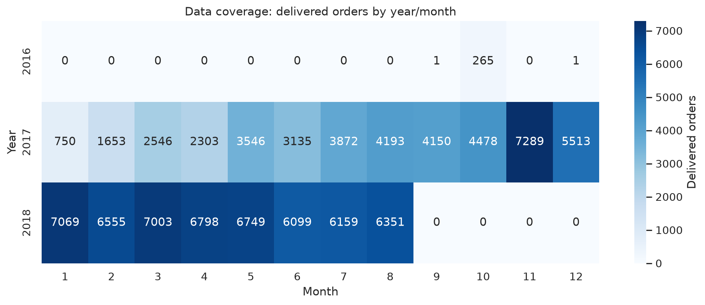

# Анализ сезонности в Olist Store

Бразильский маркетплейс электронной коммерции

Открытый набор данных за 2016–2018 годы

Основной вопрос
Как сезонность влияет на спрос и какие товары подвержены ей сильнее всего?

Дополнительные вопросы
Бизнес-метрики · прогнозируемость сезонного спроса · периоды крупных покупок

Александр @alxadrb · Тимур @coucco · Максим @werserk

<!--
Мы выбрали кейс Olist Store — бразильский маркетплейс электронной коммерции.

Работа основана на открытом наборе данных Olist Brazilian E-Commerce Public Dataset. В нём собраны заказы, товары, платежи, доставка и отзывы за 2016–2018 годы.

Основной вопрос — как сезонность влияет на спрос и какие товары зависят от неё сильнее всего.

Дополнительно мы проверяем влияние сезонности на бизнес-метрики, признаки прогнозируемого сезонного спроса и периоды крупных покупок.
-->

---
layout: default
class: dataset-slide
---

# Состав данных

9 таблиц · 1 556 417 строк суммарно · заказы за 2016–2018 годы

<table class="dataset-table">
<thead>
<tr><th>Таблица</th><th>Строк</th><th>Столбцов</th></tr>
</thead>
<tbody>
<tr><td>Заказы</td><td>99 441</td><td>8</td></tr>
<tr><td>Товары в заказах</td><td>112 650</td><td>7</td></tr>
<tr><td>Платежи</td><td>103 886</td><td>5</td></tr>
<tr><td>Отзывы</td><td>104 719</td><td>7</td></tr>
<tr><td>Товары</td><td>32 951</td><td>9</td></tr>
<tr><td>Покупатели</td><td>99 441</td><td>5</td></tr>
<tr><td>Продавцы</td><td>3 095</td><td>4</td></tr>
<tr><td>География</td><td>1 000 163</td><td>5</td></tr>
<tr><td>Перевод категорий</td><td>71</td><td>2</td></tr>
</tbody>
</table>

<h2>Ключевые поля анализа</h2>

Дата заказа<code>order_purchase_timestamp</code>

Категория товара<code>product_category_name</code>

Стоимость<code>price</code><code>payment_value</code>

Статус заказа<code>order_status</code>

<!--
На этом слайде зафиксированы главные переменные анализа.

Нам важны дата оформления заказа, категория товара, цена, сумма платежа и статус заказа.

Дата связывает наблюдение с календарём. Категория показывает, где меняется спрос. Цена и сумма платежа дают денежные показатели. Статус нужен, чтобы отделить завершённые заказы от остальных.

Дальше анализ строится вокруг этих полей.
-->

---
layout: default
class: coverage-slide
---

# Период наблюдений

Доставленные заказы: <strong>96 478</strong>

<table class="coverage-table">
<thead>
<tr><th>Год</th><th>Месяцев</th><th>Период</th></tr>
</thead>
<tbody>
<tr><td>2016</td><td>3</td><td>сентябрь, октябрь, декабрь</td></tr>
<tr><td>2017</td><td>12</td><td>январь — декабрь</td></tr>
<tr><td>2018</td><td>8</td><td>январь — август</td></tr>
</tbody>
</table>

Основной год для сезонных сравнений — <strong>2017</strong>.

<!--
Для сезонного анализа мы используем только доставленные заказы. Таких заказов в данных 96 478.

Период наблюдений неравномерный. В 2016 году есть только три месяца: сентябрь, октябрь и декабрь. В 2017 году есть полный календарный год: с января по декабрь. В 2018 году есть восемь месяцев: с января по август.

Поэтому основной год для сезонных сравнений — 2017. Он единственный покрывает все месяцы года. 2016 и 2018 мы используем как контекст, но не как полноценные годы для сравнения сезонных циклов.
-->

---
layout: default
class: method-slide
---

# Как измеряем сезонность спроса

Вопрос блока
Как сезонность влияет на спрос и какие товары подвержены ей сильнее всего?

1
Помесячная агрегация спроса по категориям за 2017 год

2
Сезонный индекс: спрос месяца / средний месячный спрос

3
Seasonality score: коэффициент вариации месячного спроса

4
Фильтр достоверности: заказы и активные месяцы

5
Классификация профиля сезонности

<!--
В этом блоке мы измеряем сезонность на уровне категорий товаров.

Сначала для каждой категории считаем помесячный спрос за 2017 год. В качестве спроса используем количество доставленных заказов.

Затем считаем сезонный индекс: спрос в конкретном месяце делится на средний месячный спрос этой категории. Значение выше единицы означает, что месяц сильнее обычного для этой категории.

Для ранжирования категорий используем коэффициент вариации месячного спроса. Чем выше коэффициент, тем сильнее спрос меняется между месяцами.

Чтобы не ловить шум малых категорий, применяем фильтр достоверности по числу заказов и количеству активных месяцев. После этого классифицируем профиль сезонности: резкий месячный пик, квартальный пик, стабильный спрос или смешанный профиль.
-->

---
layout: center
class: text-center
---

# Как будет устроена защита

вопрос → метод → доказательства → ответ

1. Спрос и сезонные категории

2. Продажи и бизнес-метрики

3. Прогнозируемость сезонности

4. Крупные покупки

<!--
Здесь объясняем новый ход. Каждый блок начинается с вопроса, затем коротко объясняет, что мы считали, показывает аргументы и заканчивается финальным ответом. В конце будет общая таблица: все вопросы, ответы и главное доказательство.
-->
