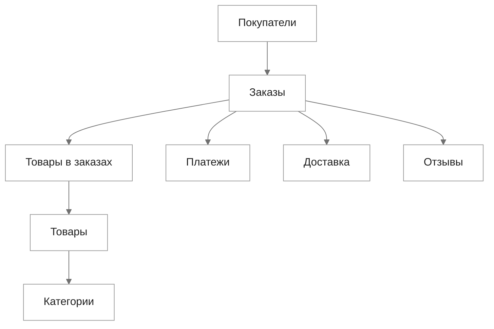

# Анализ сезонности в Olist Store

Бразильский маркетплейс электронной коммерции

Открытый набор данных за 2016–2018 годы

Александр @alxadrb · Тимур @coucco · Максим @werserk

<!--
Мы выбрали кейс Olist Store — бразильский маркетплейс электронной коммерции.

Работа основана на открытом наборе данных Olist Brazilian E-Commerce Public Dataset. В нём собраны заказы, товары, платежи, доставка и отзывы за 2016–2018 годы.

Мы анализируем сезонность: как меняется спрос во времени, какие категории сильнее зависят от сезона и как это связано с бизнес-показателями.
-->

---
layout: default
class: dataset-slide
---

# Состав данных

**Olist Brazilian E-Commerce Public Dataset** содержит сведения о заказах маркетплейса за 2016–2018 годы.

В анализе используются связи между заказом, товаром, категорией товара, оплатой, доставкой и отзывом.

Основная временная точка анализа — дата оформления заказа.

<!--
Здесь показан состав данных.

Центральная сущность — заказ. Он связан с покупателем, товарами, оплатой, доставкой и отзывом.

Для анализа сезонности ключевая связь — дата заказа, товар и категория товара. По ней видно, в какие месяцы растёт спрос на отдельные категории.

Платежи нужны для денежных показателей: общего объёма продаж и среднего чека. Доставка и отзывы дают дополнительный контекст, но не являются основным объектом анализа.

Основная временная точка — дата оформления заказа. Все сезонные сравнения дальше строятся вокруг неё.
-->

---
layout: default
class: chart-slide
---

# 00 · Какие данные пригодны для сезонности

<!--
Главное ограничение: период 2016–2018 не равномерный. 2017 — единственный почти полный год. 2016 начинается поздно, 2018 заканчивается до Q4. Поэтому основную сезонную картину строим вокруг 2017, а остальные годы используем как контекст. Это защищает нас от неверного вывода, будто отсутствие Q4 в 2018 — это реальное падение сезонности.
-->

---
layout: two-cols
---

# 00 · Вопросы задания

::left::

## Основной вопрос

Как сезонность влияет на спрос и какие товары подвержены ей сильнее всего?

## Дополнительные вопросы

1. Как сезонность влияет на продажи и бизнес-метрики в целом?
2. Можно ли заранее предсказать, что на определённый товар будет сезонный спрос? По каким признакам?
3. В какие периоды люди больше склонны к крупным покупкам?

::right::

## Как читаем задание

Нужно не просто показать сезонные графики, а дать четыре проверяемых ответа:

- про спрос и категории;
- про бизнес-метрики;
- про прогнозируемость;
- про крупные покупки.

<!--
Этот слайд фиксирует контракт презентации. Дальше каждый крупный блок будет отвечать на один вопрос задания. Так преподавателю не нужно самостоятельно сопоставлять графики с вопросами.
-->

---
layout: center
class: text-center
---

# Как будет устроена защита

вопрос → метод → доказательства → ответ

1. Спрос и сезонные категории

2. Продажи и бизнес-метрики

3. Прогнозируемость сезонности

4. Крупные покупки

<!--
Здесь объясняем новый ход. Каждый блок начинается с вопроса, затем коротко объясняет, что мы считали, показывает аргументы и заканчивается финальным ответом. В конце будет общая таблица: все вопросы, ответы и главное доказательство.
-->
